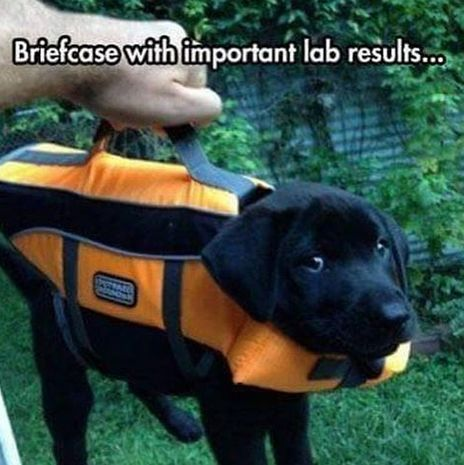

- Kristine Henriksen
- Ph.D. student
- Steno Diabetes Center Copenhagen
- University of Copenhagen

```{r setup, include=FALSE}
source(here::here("R/package-loading.R"))
load(here::here("data/nhanes_small.rda"))
```

```{r prettier-table, echo=FALSE, message=FALSE}
nhanes_small %>%
    filter(!is.na(diabetes)) %>% 
    group_by(diabetes, sex) %>% 
    summarise(mean_age = mean(age, na.rm = TRUE),
              mean_bmi = mean(bmi, na.rm = TRUE)) %>% 
    ungroup() %>% 
    mutate(mean_age = round(mean_age, 1),
           mean_bmi = round(mean_bmi, 1),
           sex = str_to_sentence(sex)) %>% 
    rename("Diabetes Status" = diabetes, Sex = sex,
           "Mean Age" = mean_age, "Mean BMI" = mean_bmi) %>%
    knitr::kable(caption = "A prettier Table. Mean values of Age and BMI for each sex and diabetes status.")

```


# Intro

This is where I'll write *cool* stuff that will **blow** your mind.



```{r kitten-image}
knitr::include_graphics(here::here("doc/images/dog.jpeg"))
```


# Methods and Results

## Analysis

```{r}
2+2
```


# Discussion
